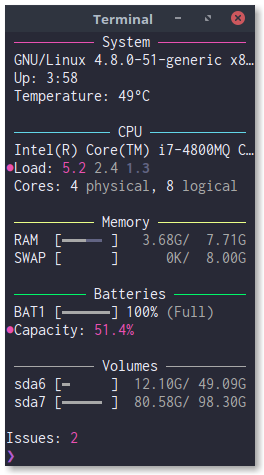

# health

~Conky~ Health is a free, light-weight system monitor for ~X~ Console, that displays ~any~ some kind of useful information on your ~desktop~ console.

<p align="center">
  
</p>

Unlike conky, it is a very simple script intended to quickly highlight potentials issues on the system, even without a graphical interface.

Works best with watch:

```sh
watch -ctn 5 health
```
